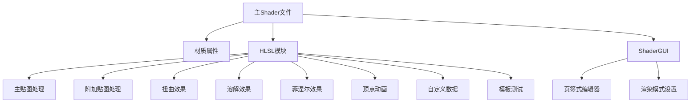

# NShader 模块文档

## 概述
NShader是一个功能丰富的Unity Shader，采用模块化设计，包含多种特效功能。Shader使用URP渲染管线，支持多种渲染模式。

## 整体架构

## 模块功能说明

### 1. 主贴图处理 (MainTexture.hlsl)
- 功能：处理基础贴图采样、UV变换和遮罩
- 特性：
  - 支持普通/极坐标/漩涡三种UV模式
  - 亮度调整
  - 遮罩通道选择
  - UV动画控制

### 2. 附加贴图处理 (AdditionalTexture.hlsl)
- 功能：处理附加贴图混合
- 特性：
  - 三种混合模式（Alpha/Add/Multiply）
  - 独立UV变换控制
  - 遮罩支持

### 3. 扭曲效果 (DistortEffect.hlsl)
- 功能：实现UV扭曲效果
- 特性：
  - 强度控制（X/Y方向独立）
  - FlowMap支持，可模拟流体效果
  - 遮罩控制

### 4. 溶解效果 (DissolveEffect.hlsl)
- 功能：实现溶解过渡效果
- 特性：
  - 边缘颜色和宽度控制
  - 平滑度调整
  - 附加贴图增强

### 5. 菲涅尔效果 (Fresnel.hlsl)
- 功能：实现边缘发光效果
- 特性：
  - 视角偏移
  - 范围/强度控制
  - 可作为透明度使用

### 6. 顶点动画 (VertexAnimation.hlsl)
- 功能：实现顶点位移动画
- 特性：
  - 贴图驱动
  - 模型/世界空间选择
  - 遮罩控制

### 7. 自定义数据 (CustomData.hlsl)
- 功能：通过顶点数据控制Shader参数
- 可控制参数：
  - UV偏移
  - 亮度增强
  - 溶解控制
  - 扭曲增强

### 8. 模板测试 (StencilTest.hlsl)
- 功能：提供模板测试配置
- 特性：
  - 比较函数设置
  - 读写掩码

## 引用关系
- 主Shader文件 (TabExampleShader.shader) 引用所有HLSL模块
- 各HLSL模块共享：
  - ShaderUtils.hlsl (公共工具函数)
  - MaterialProperties.hlsl (材质属性定义)
- 编辑器扩展：
  - TabShaderGUI.cs (基类)
  - TabExampleShaderGUI.cs (具体实现)

## 注意事项
1. **性能考虑**：
   - 同时启用多个特效会增加Shader复杂度
   - 建议根据实际需求选择性启用功能

2. **使用建议**：
   - 透明物体建议关闭深度写入
   - 溶解效果需要合理设置边缘宽度和平滑度
   - 扭曲效果强度不宜过大

3. **编辑器扩展**：
   - 功能按页签分类，A-H页签对应不同功能模块
   - 页签颜色指示功能状态（除A页签外，其余页签在对应功能启用时高亮显示特定颜色）：
     - 蓝色系 (如 #03A9F4)：主贴图（A页签，常亮）
     - 黄绿色系 (如 #CDDC39)：附加贴图（B页签，启用时）
     - 黄色系 (如 #FFC107)：溶解（C页签，启用时）
     - 橙红色系 (如 #FF5722)：扭曲（D页签，启用时）
     - 青蓝色系 (如 #00BCD4)：菲涅尔（E页签，启用时）
     - 黄色系 (如 #FFEB3B)：顶点动画（F页签，启用时）
     - 紫色系 (如 #9C27B0)：自定义数据（G页签，启用时）
     - 红色系 (如 #FF5252)：模板测试（H页签，启用时）

4. **兼容性**：
   - 仅支持URP渲染管线
   - 需要Unity 2019.4或更高版本